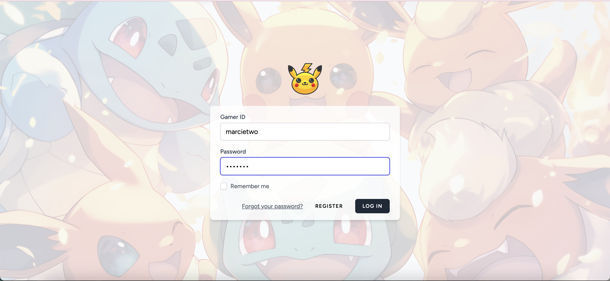
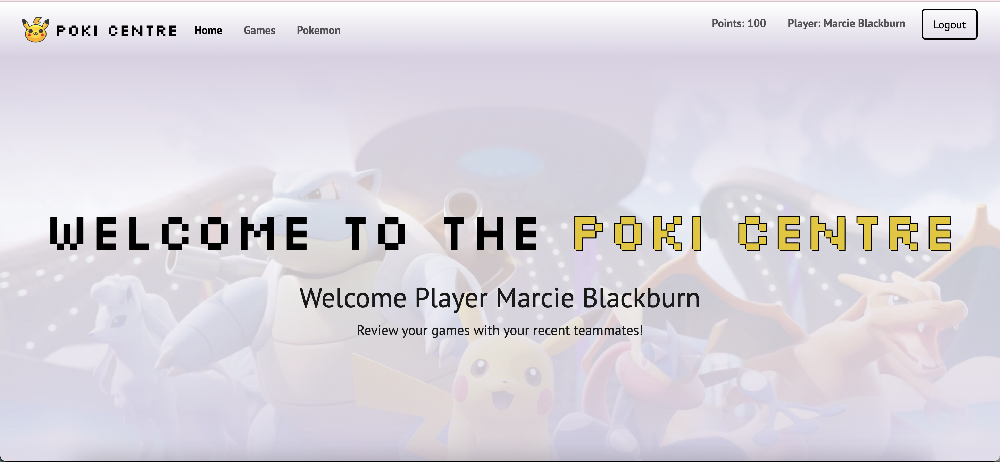
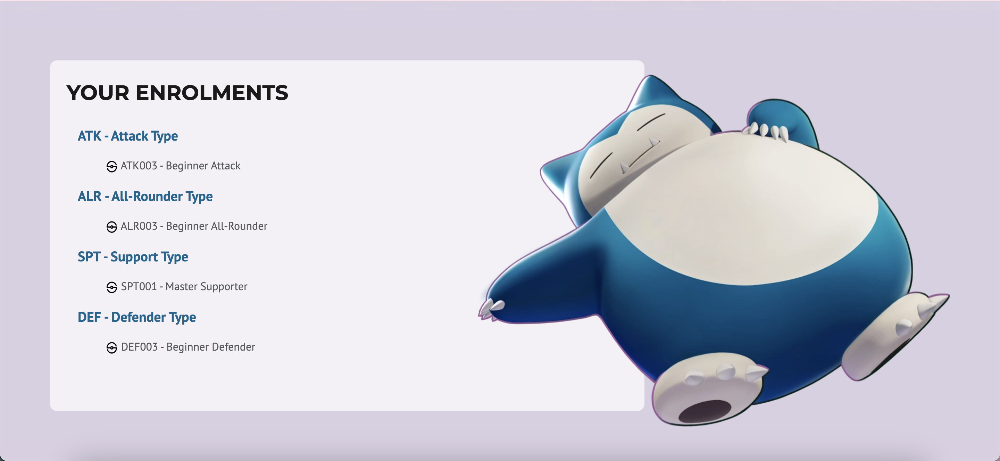
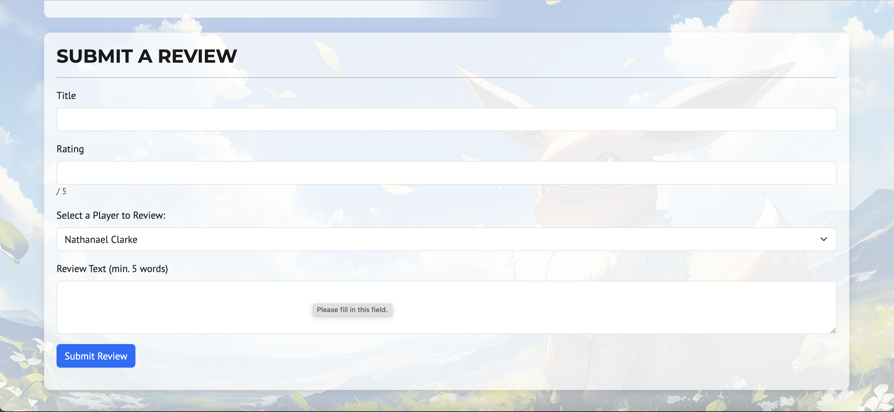
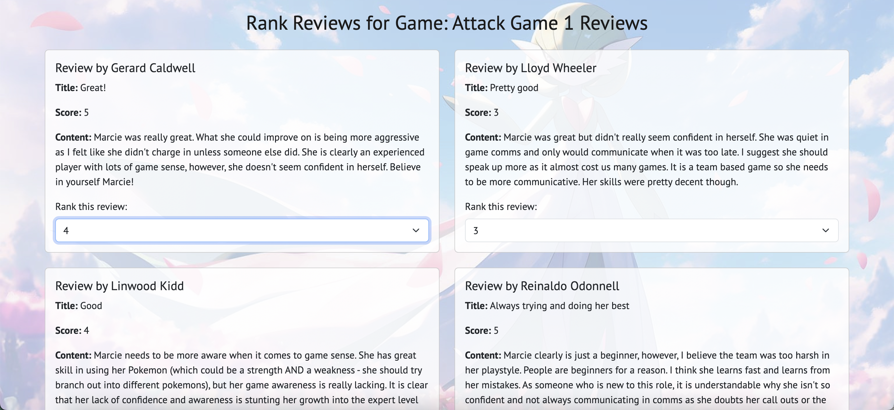
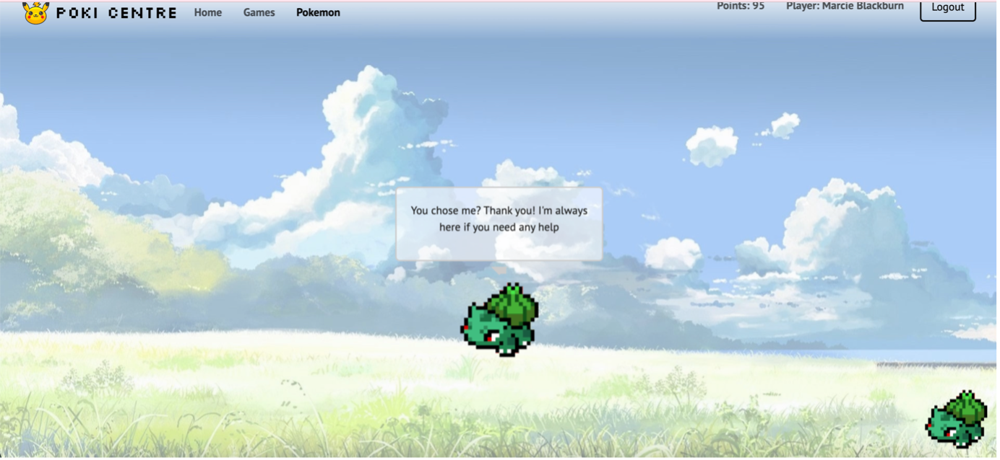
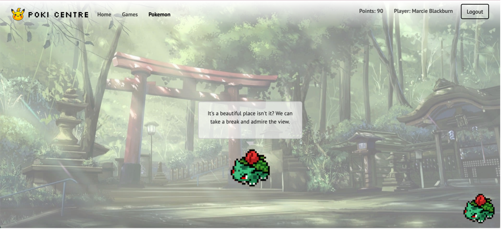
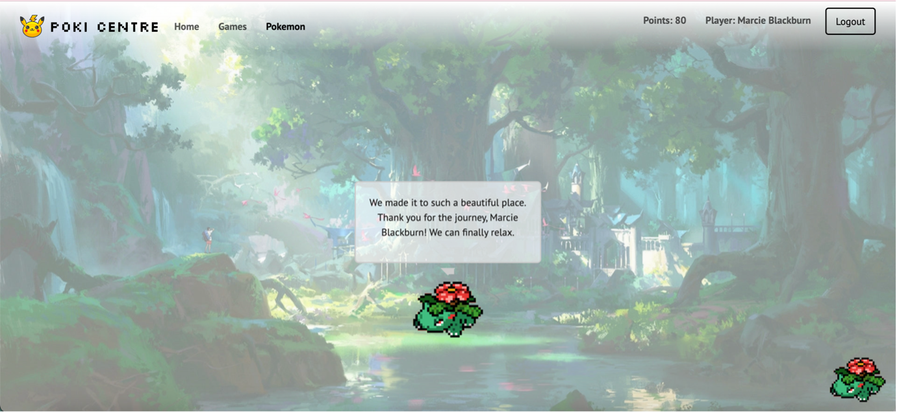

# ⚡️ PokiCentre
Welcome to the **PokiCentre**! This Laravel-powered website allows players to review each other after playing Pokémon Unite. It’s fun, interactive, and comes with a Pokémon-themed twist! 🌟

---

## 💫 About This Project
Hello! This site is all about teaming up, playing Pokémon Unite, and leaving reviews for your teammates. Here's how it works:
- **Two user types:** Players and Coaches.
- **Class-based system:** Players and coaches are enrolled in classes sorted by Pokémon types and difficulty levels.  
- **Coaches’ role:** Creating teams and managing players.  
- **Players’ role:** Battling and leaving reviews for teammates.
- **Shop:** Purchase a Pokémon companion and accessorise and evolve it!
Each player and coach is enrolled in classes, which are sorted by Pokémon types and difficulty levels. So whether you're a seasoned pro or just starting out, there’s a class for everyone to level up their game!

---

## ✨ Features

### 🔑 **Login**
Logging in is super easy—just use your Pokémon Unite gamer ID! I've pre-seeded the site with data with various users.

────────────────────────────────────────────

### 🏡 **Home Page**
The homepage displays all your enrolled classes and classes are organised by Pokémon Type!

────────────────────────────────────────────

### 👤 **Profile**
Your profile is your personal gaming journal! Here, you can check out the games you've played, the reviews you’ve written, and the feedback you’ve received. Coaches are able to see all players profile page and enrol them in their classes.

────────────────────────────────────────────

### 📚 **Class Page**
All users are able to see their class page which will detail the coaches in their class, the different difficulty levels, and the games assigned to you in that class.

────────────────────────────────────────────

### 📝 **Review System**
This is the heart of the site. Players can write reviews for each other based on the games they’ve played.
- Features include:
  - Review deadlines.
  - Number of required reviews.
  - Maximum score.
  - Review instructions.
- **Assignment types:**
  - **Team Assign:** Coaches organise teams.
  - **Player Assign:** Players pick teammates manually.

────────────────────────────────────────────

### ⭐ **Ranking Reviews**
To encourage players to write useful reviews, I have created a ranking system. Once a player recieves all their reviews for that specific game, they need to assess each review received and rank them from highest to lowest. Rankings turn into points, and points let you shop for cool stuff. Pro tip: Rank #1 gets the most points, so aim high!

────────────────────────────────────────────

### 🛒 **Shop System**
- Use points to buy Pokémon! Each Pokémon has:
  - Unique backgrounds.
  - Personalized dialogues.
- Purchase accessories to customize your Pokémon.

────────────────────────────────────────────

### 🐾 **Pokémon Companion**
Your Pokémon isn’t just for show—it’s your cute little companion, hanging out at the bottom right of the page. It even has its own homepage where it "lives." As your Pokémon evolves, its dialogue changes, and it grows alongside you.

---

## 🛠️ **Tech Stack**
- **Backend:** Laravel (PHP)
- **Frontend:** Blade templates, CSS
- **Database:** SQLite

---

## 🔥 Final Notes
This project was a blast to make, and I hope you have just as much fun exploring it. Thanks for stopping by! 🎮✨